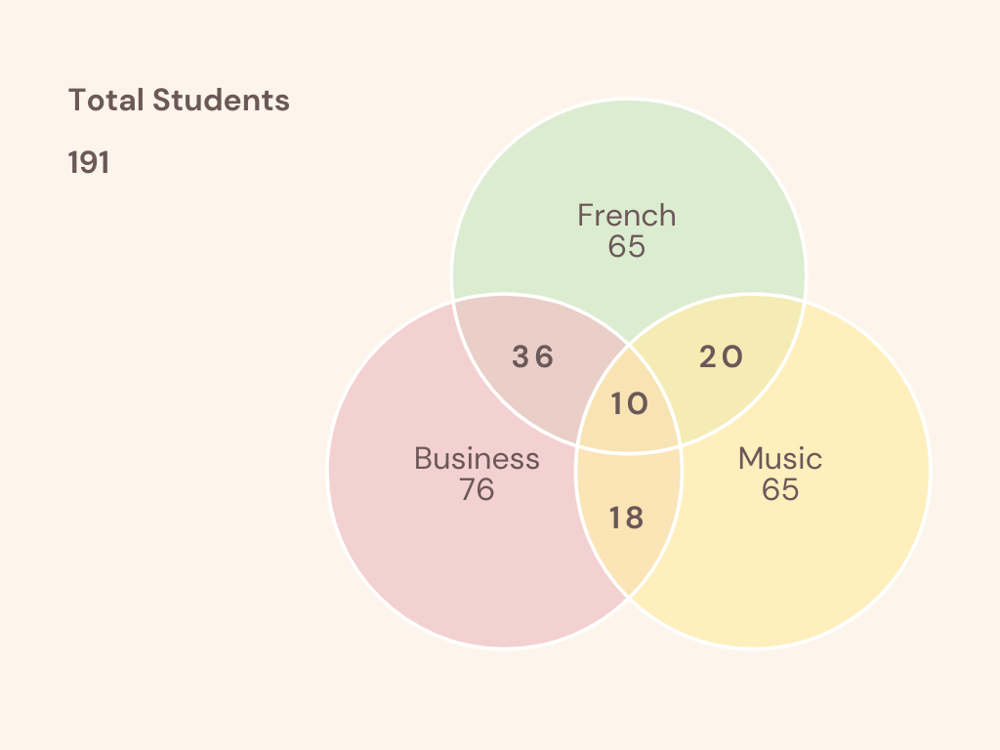
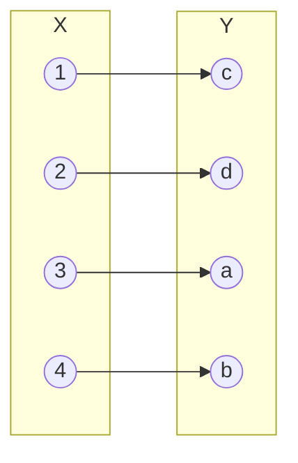
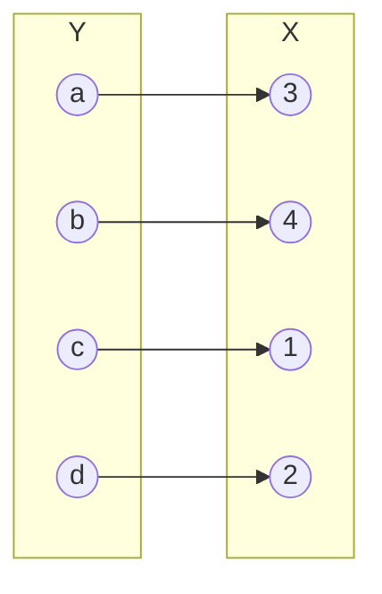
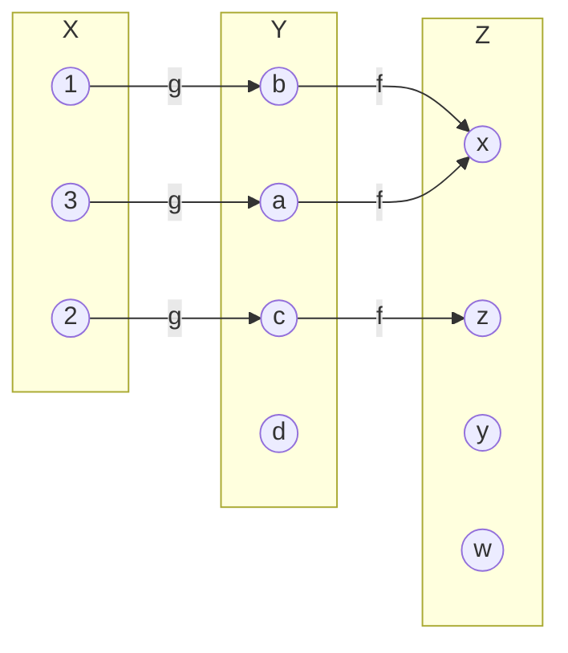

## **Math Induction.**
### 1. *Using Math Induction, prove that for every positive integer n,*
$$1(1!) + 2(2!) + · · · + n(n!) = (n + 1)! − 1$$

### **SOLUTION**
* Basis Step (n = 1)

$$1(1!) = 1 * 1 = 1 \tag{1}$$

$$
\begin{aligned}
  (1 + 1)! - 1 &= 2!-1\\
  &=2*1-1\\
  &=1 
\end{aligned}
\tag{2}
$$

$$(1) = (2)$$
* Inductive Step  
Assume *the equation is true for n*

$$
1(1!)+2(2!)+...+n(n!) = (n+1)!-1
$$

* Now

$$
\begin{split}
&\color{red}1(1!)+2(2!)+...+n(n!) + \color{blue}(n+1)((n+1)!)\\
&=\color{red}(n+1)!-1 + \color{blue}(n+1)((n+1)!)\\
&=((n+1)!)(n+2)-1\\
&=(n+2)!-1\\
&=((n+1)+1)!-1\\
\end{split}
$$

Since the Basis Step and the Inductive Step have been verified, the Principle of Mathematical Induction tells us that $1(1!) + 2(2!) + · · · + n(n!) = (n + 1)! − 1$ is true for all the positive integers $n$.  

---

### 2. *Using Math Induction, prove that for every positive integer $n \ge 3$,*
$$2n + 1 \le 2^n$$

### **SOLUTION**
* Basis Step (n = 3)
$$2*3 + 1=7\tag{1}$$
$$2^3 = 8\tag{2}$$
$$(1) < (2)$$

* Inductive Step  
Assume *the inequation is true for n*
$$2n + 1 \le 2^n$$

* Now  

$$
\begin{split}
  &2(n+1)+1 \\
  &= 2n+2+1\\
  &=2n+1+2\\
  &\le 2^n+2\\
  &\lt 2^n + 2^n  \ (\forall n\ge3)\\
  &=2^{n+1}\\
\end{split}\\
$$

Since the Basis Step and the Inductive Step have been verified, the Principle of Mathematical Induction tells us that $2n + 1 \le 2^n$ is true for every positive integer $n \ge 3$

---

### 3. Using Math Induction, prove that
$11^n − 6$ is divisible by 5, for all n ≥1

### SOLUTION

* Basis Step (n = 1)
$$11 ^ 1 - 6 = 5$$
$$5 \bmod 5 = 0$$

* Inductive Step
Assume $11^n - 6$ is divisible by 5 for n, i.e. 
$$(11^n - 6) \bmod 5 = 0$$

* Now

$$
\begin{split}
&11^{n+1} - 6\\
&= 11^n \times 11 - 6\\
&=(10 + 1) \times 11^n -6\\
&=10 \times 11^n + (11^n - 6)\\
\end{split}
$$
$$
\because
10 \times 11^n \bmod 5 = 0 \And 11^n-6 \bmod 5 = 0\\
\therefore 11^(n+1)-6 \bmod 5 = 0
$$

Since the Basis Step and the Inductive Step have been verified, the Principle of Mathematical Induction tells us that $(11^n - 6) \bmod 5 = 0$

---

## **Set**

### 4. Let the universe be the set $U = \lbrace 1, 2, 3, 4, 5, 6, 7, 8, 9, 10 \rbrace $. Let $A = \lbrace 1, 4, 7, 10), B = \lbrace 1, 2, 3, 4, 5 \rbrace \ and \ C = \lbrace 2, 4, 6, 8 \rbrace $. List the elements of each set.
(a) $B \cap C$

(b) $\bar{A}-B$

(c) $A \cup B − (C − B)$

### SOLUTION
(a) $B \cap C = \lbrace 1, 2, 3, 4, 5 \rbrace  \cap \lbrace 2, 4, 5, 8 \rbrace  = \lbrace 2, 4 \rbrace$

(b) 

$$
\begin{split}
&\bar{A}-B = (U - A) - B \\
&= \lbrace 1, 2, 3, 4, 5, 6, 7, 8, 9, 10 \rbrace  - \lbrace 1, 4, 7, 10 \rbrace  - \lbrace 1, 2, 3, 4, 5 \rbrace  \\
&= \lbrace 6, 8, 9 \rbrace \\
\end{split}
$$

(c) 

$$
\begin{split}
&A \cup B − (C − B) \\
&= \lbrace 1, 4, 7, 10 \rbrace  \cap \lbrace 1, 2, 3, 4 \rbrace  - (\lbrace 2, 4, 6, 8 \rbrace  - \lbrace 1, 2, 3, 4 \rbrace ) \\
&= \lbrace 1, 2, 3, 4, 6, 8 \rbrace  - \lbrace 6, 8 \rbrace \\
&= \lbrace 1, 2, 3, 4 \rbrace \\
\end{split}
$$

---

### 5. Let $A = \lbrace x|x^2-4x+4=1 \rbrace$ and $B=\lbrace 1, 3 \rbrace$. Prove that $A = B$.
### SOLUTION
1. prove $\forall{x| x \in A},\ x \in B$

  Solving the equation $x^2 -4x + 4 = 1$, we find that $x=1\ or\ x=3$  
  Therefore $\forall{x| x \in A},\ x \in B$

2. prove $\forall{x| x \in B},\ x \in A$

   if x = 1,  
   $1^2-4 \times 1 + 4 = 1-4+4=1$, therefore $x \in A$  
   if x = 3,  
   $3^2-4 \times 3 + 4 = 9-4 \times 3 + 4=1$, again $x \in A$

We conclude that $A=B$

---

### 6. Let $X=\lbrace 1, 2 \rbrace$ and $Y=\lbrace a, b, c \rbrace$. List the elements in each set.
(a) $X \times Y$

(b) $Y \times X$

(c) $X \times X \times X$

### SOLUTION
(a)

$$
\begin{aligned}
&X \times Y\\
&=\lbrace 1, 2 \rbrace  \times \lbrace a, b, c \rbrace \\
&=\lbrace (1, a), (1, b), (1, c), (2, a), (2, b), (2, c)  \rbrace 
\end{aligned}
$$

(b)

$$
\begin{aligned}
&Y \times X\\
&=\lbrace a, b, c \rbrace  \times \lbrace 1, 2 \rbrace \\
&=\lbrace (a, 1), (a, 2), (b, 1), (b, 2), (c, 1), (c, 2)  \rbrace 
\end{aligned}
$$

(c)

$$
\begin{aligned}
&X \times X \times X\\
&=\lbrace 1, 2 \rbrace  \times \lbrace 1, 2 \rbrace  \times \lbrace 1, 2 \rbrace \\
&=\lbrace (1,1), (1,2), (2,1), (2,2)  \rbrace  \times \lbrace 1,2 \rbrace \\
&=\lbrace \\
&\qquad((1,1), 1), ((1,1), 2), \\
&\qquad((1,2), 1), ((1,2), 2), \\
&\qquad((2,1), 1), ((2,1), 2), \\
&\qquad((2,2), 1), ((2,2), 2) \\
&\quad \rbrace 
\end{aligned}
$$

---

### 7. Suppose there is a group of 191 students, of which 10 are taking French, business, and music; 36 are taking French and business; 20 are taking French and music; 18 are taking business and music; 65 are taking French; 76 are taking business; and 63 are taking music.
(a) How many are taking none of the three subjects?  
(b) Draw a Venn Diagram to illustrate the universal set U of students, set F those students taking
French, set B for those students taking business, and set M for those students taking music.
Write the number of students belonging each region depicted in the diagram.

### SOLUTION
(a) Let 
- U = all the students
- F = all the students taking French
- B = all the students taking business
- M = all the students taking music

$$
\tag{Given}
\begin{aligned}
&|U| = 191\\
&|F| = 65\\
&|B| = 76\\
&|M| = 63\\
&|F \cap B \cap M| = 10\\
&|F \cap B| = 36\\
&|F \cap M| = 20\\
&|B \cap M| = 18
\end{aligned}
$$

Therefore

$$
\tag{Inclusion-Exclusion Principle}
\begin{aligned}
&\quad|\bar{F} \cap \bar{B} \cap \bar{M}|\\
&= |U| - (|F| + |B| + |M|) + (|F \cap B| + |F \cap M| + |B \cap M|) - |F \cap B \cap M|\\
&= 191 - (65 + 76 + 63) + (36 + 20 + 18) - 10\\
&= 51
\end{aligned}
$$

(b)

---
## **Functions**

### 8. Determine whether

$$f=\lbrace (1, c), (2, a), (3, b), (4, c), (2, d) \rbrace$$

is a function from $X=\lbrace 1, 2, 3, 4 \rbrace$ to $Y=\lbrace a, b, c, d \rbrace$. If it is a function,
(a) find its domain and range
(b) draw its arrow diagram
(c) determine if it is one-to-one, onto, or both. If it is both, give the description of the inverse function as a set of ordered pairs, draw its arrow diagram, and give the domain and range of the inverse function.

### SOLUTION

$f=\lbrace (1, c), (2, a), (3, b), (4, c), (2, d) \rbrace$ is not a function from $X=\lbrace 1, 2, 3, 4 \rbrace$ to $Y=\lbrace a, b, c, d \rbrace$, because the element 2 in X is not assigned a *unique* element in Y (2 is assigned the values a and d)

---

### 9. Determine whether

$$f=\lbrace (1, c), (2, d), (3, a), (4, b) \rbrace$$

is a function from $X=\lbrace 1, 2, 3, 4 \rbrace$ to $Y=\lbrace a, b, c, d \rbrace$. If it is a function,
(a) find its domain and range
(b) draw its arrow diagram
(c) determine if it is one-to-one, onto, or both. If it is both, give the description of the inverse function as a set of ordered pairs, draw its arrow diagram, and give the domain and range of the inverse function.

### SOLUTION
$f=\lbrace (1, c), (2, d), (3, a), (4, b) \rbrace$ is a function from $X=\lbrace 1, 2, 3, 4 \rbrace$ to $Y=\lbrace a, b, c, d \rbrace$. Each element in X is assigned a unique value in Y. 

$$
\begin{aligned}
f(1)=c \\
f(2)=d \\
f(3)=a \\
f(4)=b
\end{aligned}
$$

(a) The domain of the function $f$ is $\lbrace 1, 2, 3, 4 \rbrace$, the range of the function $f$ is $\lbrace a, b, c, d \rbrace$

(b)

(c)  
The function $f$ is one-to-one because $\forall{y \in Y}$ there is *exactly* one $x \in X$ such that $f(x)=y$.  
The function $f$ is also onto because $\forall{y \in Y}\  \exists x \in X$ such that $f(x)=y$.  
The inverse function $f^{-1}=\lbrace (a, 3), (b, 4), (c, 1), (d, 2) \rbrace$, the domain is $Y=\lbrace a, b, c, d \rbrace$, the range is $X=\lbrace 1, 2, 3, 4 \rbrace$.

---

### 10. Given

$$g=\lbrace (1, b), (2, c), (3, a) \rbrace$$

a function from $X= \lbrace 1, 2, 3 \rbrace$ to $Y= \lbrace a, b, c, d \rbrace$ and 

$$f= \lbrace (a, x), (b, x), (c, z), (d, w) \rbrace$$

a function from $Y$ to $Z$ = $\lbrace w, x, y, z \rbrace$, write $f \circ g$ as a set of ordered pairs and draw the arrwo diagram  of $f \circ g$

### SOLUTION

$$
\begin{aligned}
&f(g(x)) from\ X\ to\ Z\ is\\
&f(g(1)) = f(b) = x\\
&f(g(2)) = f(c) = z\\
&f(g(3)) = f(a) = x\\
\end{aligned}
$$

---
## Sequences and Strings

### 11. Let t be the sequence defined by

$$t_n=2n-1, \qquad n \ge 1$$

(a) Find $\Sigma^{3}_{i=1}t_i$.

(b) Find $\Sigma^{7}_{i=3}t_i$.

(c) Find $\prod^{3}_{i=1}t_i$.

(d) Find $\prod^{7}_{i=3}t_i$.

(e) Find a formula that represents this sequence as a sequence whose lower index is 0.

(f) Is $t$ decreasing?

(g) Is $t$ increasing?

(h) Is $t$ nondecreasing?

(i) Is $t$ nonincreasing?

### SOLUTION

(a) $\Sigma^{3}_{i=1}t_i=t_1+t_2+t_3=1+3+5=9$

(b) $\Sigma^{7}_{i=3}t_i=t_3+t_4+t_5+t_6+t_7=5+7+9+11+13=45$

(c) $\prod^{3}_{i=1}t_i=t_1 \times t_2 \times t_3=1 \times 3 \times 5=15$

(d) $\prod^{7}_{i=3}t_i=t_3 \times t_4 \times t_5 \times t_6 \times t_7=5 \times 7 \times 9 \times 11 \times 13=45045$

(e) $t_n = 2n+1, \qquad n \ge 0$

(f) $t$ is not decreasing because $t2>t1$

(g) $t$ is increasing because $\forall{n_1, n_2 | n_2 \gt n_1 \ge 1}, t_{n_2} > t_{n_1}$

(h) $t$ is nondecreasing because $t$ is increasing

(i) $t$ is not nonincreasing because $t$ is increasing

---

### 12. Compute the given quantity using the strings

$$\alpha=baab, \beta=caaba, \gamma=bbab$$

(a) $\alpha\beta$

(b) $\beta\alpha$

(c) $\gamma\alpha$

(d) $\beta\gamma$

(e) $|\alpha\beta|$

(f) $|\alpha\alpha|$

### SOLUTION

(a) $\alpha\beta=baabcaaba$

(b) $\beta\alpha=caababaab$

(c) $\gamma\alpha=bbabbaab$

(d) $\beta\gamma=caababbab$

(e) $|\alpha\beta|=|baabcaaba|=9$

(f) $|\alpha\alpha|=|baabbaab|=8$

---

### 13. Find all substrings of the string aabaabb.
### SOLUTION
The substrings of the string $aabaabb$ are:
- null string
- $a, b, c$
