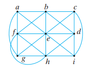
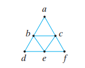
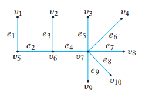
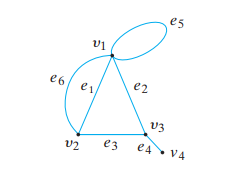
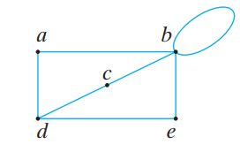
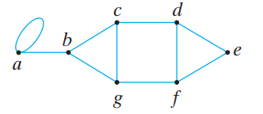
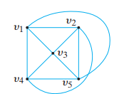
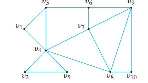

## Example of Graphs

### 1. Explain why the graph below does not have a path from *a* to *a* that passes through each edge exactly one time.

### SOLUTION
The vertex $b$'s degree is 5, there is no Euler cycle in the graph.

---

### 2. Show that graph below has a path from *a* to *a* that passes through each edge exactly one time by finding such a path by inspection.

### SOLUTION

a->b->d->e->f->c->b->e->c->a

---

### 3. State which graphs are bipartite graphs. If the graph is bipartite, specify the disjoint vertex sets
(a) 

(b)

 

### SOLUTION
$a$ is a bipartite graph, $V_1=\lbrace v_1, v_2, v_3, v_4, v_8, v_9, v_{10} \rbrace, V_2=\lbrace v_5, v_6, v_7 \rbrace$  
$b$ is not bipartite, because the loop $e_5$ incident on the single vertex $v_1$.

---

## Paths and Cycles

### 4. tell whether the given path in the graph is
(a) A simple path  
(b) A cycle  
(c) A simple cycle  

i. (a,d,c,d,e)
ii. (e,d,c,b).
iv. (b,c,d,a,b,e,d,c,b).

### SOLUTION
i. Path (a,d,c,d,e) 
- is not a simple path because vertex $d$ is repeated.
- is not a cycle because the start and the end vertices are not the same.
- is not a cycle because it is not a cycle.

ii. Path (e,d,c,b)
- is a simple path because no repeated vertices in the path.
- is not a cycle because the start and the end vertices are not the same.
- is not a cycle because it is not a cycle.

iv. Path (b,c,d,a,b,e,d,c,b)
- is not a simple path because vertex $b$ is repeated.
- is not a cycle because there is repeated edge (c,d).
- is not a cycle because it is not a cycle.

---

### 5. Find all simple paths from a to e.

### SOLUTION
(a,b,c,d,e)  
(a,b,c,d,f,e)  
(a,b,c,g,f,e)  
(a,b,c,g,f,d,e)  
(a,b,g,f,e)  
(a,b,g,f,d,e)  
(a,b,g,c,d,e)  
(a,b,g,c,d,f,e)

---

### 6. Decide whether the graph has an Euler cycle.
(a)

(b)

### SOLUTION
(a) The degree of each vertex is:

$$
\delta(v_1)=4\\
\delta(v_2)=4\\
\delta(v_3)=4\\
\delta(v_4)=4\\
\delta(v_5)=4\\
$$
Every vertex has even degree, it has an Euler cycle

(b)
$v_3$'s degree is 3, it does not have an Euler cycle.

---