## Example of Graphs

### 1. Explain why the graph below does not have a path from *a* to *a* that passes through each edge exactly one time.

### SOLUTION
The vertex $b$'s degree is 5, there is no Euler cycle in the graph.

---

### 2. Show that graph below has a path from *a* to *a* that passes through each edge exactly one time by finding such a path by inspection.

### SOLUTION

a->b->d->e->f->c->b->e->c->a

---

### 3. State which graphs are bipartite graphs. If the graph is bipartite, specify the disjoint vertex sets
(a) 

(b)

 

### SOLUTION
$a$ is a bipartite graph, $V_1=\lbrace v_1, v_2, v_3, v_4, v_8, v_9, v_{10} \rbrace, V_2=\lbrace v_5, v_6, v_7 \rbrace$  
$b$ is not bipartite, because the loop $e_5$ incident on the single vertex $v_1$.

---

## Paths and Cycles

### 4. tell whether the given path in the graph is
(a) A simple path  
(b) A cycle  
(c) A simple cycle  

i. (a,d,c,d,e)  
ii. (e,d,c,b)  
iv. (b,c,d,a,b,e,d,c,b)  

### SOLUTION
i. Path (a,d,c,d,e) 
- is not a simple path because vertex $d$ is repeated.
- is not a cycle because the start and the end vertices are not the same.
- is not a cycle because it is not a cycle.

ii. Path (e,d,c,b)
- is a simple path because no repeated vertices in the path.
- is not a cycle because the start and the end vertices are not the same.
- is not a cycle because it is not a cycle.

iv. Path (b,c,d,a,b,e,d,c,b)
- is not a simple path because vertex $b$ is repeated.
- is not a cycle because there is repeated edge (c,d).
- is not a cycle because it is not a cycle.

---

### 5. Find all simple paths from a to e.

### SOLUTION
(a,b,c,d,e)  
(a,b,c,d,f,e)  
(a,b,c,g,f,e)  
(a,b,c,g,f,d,e)  
(a,b,g,f,e)  
(a,b,g,f,d,e)  
(a,b,g,c,d,e)  
(a,b,g,c,d,f,e)

---

### 6. Decide whether the graph has an Euler cycle.
(a)

(b)

### SOLUTION
(a) The degree of each vertex is:

$$
\begin{aligned}
\delta(v_1)=4\\
\delta(v_2)=4\\
\delta(v_3)=4\\
\delta(v_4)=4\\
\delta(v_5)=4\\
\end{aligned}
$$

Every vertex has even degree, it has an Euler cycle

(b)
$v_3$'s degree is 3, it does not have an Euler cycle.

---

## Hamiltonian Cycles and the Traveling Salesperson Problem

### 7. Find a Hamiltoninan cycle

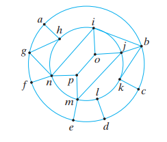

### SOLUTION
(a, b, c, d, e, f, g, n, p, m, i, k, j, o, i, h, a)

### 8. Show that the graph below does not contains a Hamiltonnian cycle

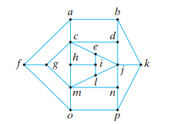

### SOLUTION

There are 16 vertices, a Hamiltanian cycle must has 16 edges. Suppose that we could eliminate edges from the graph, leaving just a Hamiltonian cycle. We would have to eliminate 3 edges incident at c, 3 edges incident at j, 3 edges incident at m, 1 edge incident at b, 1 edge incident at p, and 1 edge incident at f. But this leaves $27-3-3-3-1-1-1=15$ edges. Therefore the graph does not contain a Hamiltonian cycle.

---

### 9. Solve the traveling salesperson problem for the graph shown.

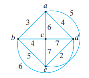

### SOLUTION
(a, b, c, d, e, a), total length is $3+4+7+2+4=20$

---

### 10. Let G be a bipartite graph with disjoint vertex sets $V_1$ and $V_2$. Show that if G has a Hamiltonian cycle, $V_1$ and $V_2$ have the same number of elements.

### SOLUTION
Suppose $G$ has a Hamiltonian cycle. This cycle must alternate between vertices in $V_1$ and vertices in $V_2$. This is because in a bipartite graph, edges only connect vertices from different sets.  
As we travers the Hamiltonian cycle, we must visit each vertex in $V_1$ and each vertex in $V_2$ exactly once. Since the cycle alternates between the 2 sets, for every vertex in $V_1$ there must b a correcponding vertex in $V_2$ follows it (and vice versa).  
Therefore, for a Hamiltonian cycle to exist in a bipartite graph $G$, it must be the case that $|V_1|=|V_2|$.

## A Shortest-Path Algorithm
### 11. find the length of a shortest path and a shortest path between $a,g$ in the weighted graph.

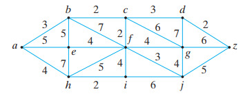

### SOLUTION

The shortest path from a to g is $(a, b, c, g)$, the length is $L(g)=3+2+6=11$

## Representation of Graphs

### 12. 

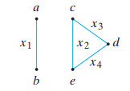

(a) Write the adjacency matrix  
(b) Write the incidence matrix

### SOLUTION
(a)

$$
\begin{array}{rcl}
&\begin{array}{c}
a&b&c&d&e
\end{array}\\ 
\begin{matrix}
a\\
b\\
c\\
d\\
e\\
\end{matrix}
&\begin{pmatrix}
0&1&0&0&0\\
1&0&0&0&0\\
0&0&0&1&1\\
0&0&1&0&1\\
0&0&1&1&0\\
\end{pmatrix}
\end{array}
$$

(b)

$$
\begin{array}{rcl}
&\begin{array}{c}
x_1&x_2&x_3&x_4
\end{array}\\ 
\begin{matrix}
a\\
b\\
c\\
d\\
e\\
\end{matrix}
&\begin{pmatrix}
1\ &0\ &0\ &0\\
1\ &0\ &0\ &0\\
0\ &1\ &1\ &0\\
0\ &0\ &1\ &1\\
0\ &1\ &0\ &1\\
\end{pmatrix}
\end{array}
$$

---

### 13. draw the graph represented by the adjacency matrix

$$
\begin{array}{rcl}
&\begin{array}{c}
a&b&c&d&e&f
\end{array}\\ 
\begin{matrix}
a\\
b\\
c\\
d\\
e\\
f\\
\end{matrix}
&\begin{pmatrix}
0&0&1&0&0&1\\
0&2&0&1&2&0\\
1&0&0&0&0&1\\
0&1&0&0&1&0\\
0&2&0&1&0&0\\
1&0&1&0&0&0\\
\end{pmatrix}
\end{array}
$$

### SOLUTION

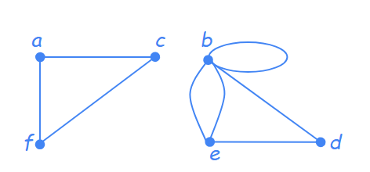

---

### 14. Draw the graphs represented by the incidence matrices

$$
\begin{matrix}
  a\\b\\c\\d\\e\\
\end{matrix}
\begin{pmatrix}
  0&1&0&0&1&1\\
  0&1&1&0&1&0\\
  0&0&0&0&0&1\\
  1&0&0&1&0&0\\
  1&0&0&1&0&0\\
\end{pmatrix}
$$

### SOLUTION

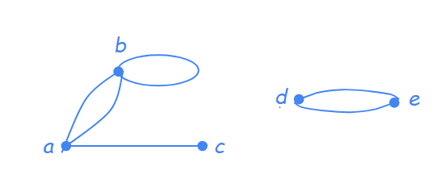

## Isomorphisms of Graphs
### 15.
(a) Prove that the graphs G1 and G2 are isomorphic.

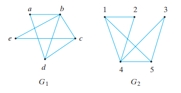

(b)  Prove that the graphs G1 and G2 are not isomorphic.

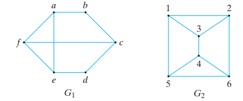

### SOLUTION
(a) Map each vertex in $G_1$ to $G_2$ in the relation $\lbrace (a,3), (b,4), (c,1), (d,5), (e,2) \rbrace$, we have the one-to-one relation of edges in $G_1$ and $G_2$, 

$$
(a,b)=(3,4)\\
(a,d)=(3,5)\\
(b,c)=(4,1)\\
(b,d)=(4,5)\\
(b,e)=(4,2)\\
(c,d)=(1,5)\\
(c,e)=(1,2)
$$

---

### 16 Determine whether the graphs $G_1$ and $G_2$ are isomorphic. Prove your answer
(a)

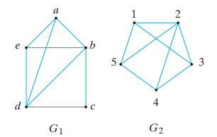

(b)

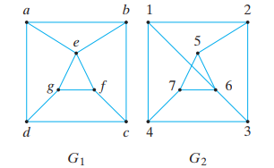

### SOLUTION
(a) $G_1$ and $G_2$ are not isomophic. $G_1$ has 2 vertices of degree 4: $b$ and $d$, but $G_2$ has only one vertex $2$ of degree 4.

(b) $G_1$ and $G_2$ are not isomophic. $G_1$ has 2 simple cycle of length 3: (a,b,e) and (e,f,g), but $G_2$ has only 1 simple cycle of length 3: (5,6,7)