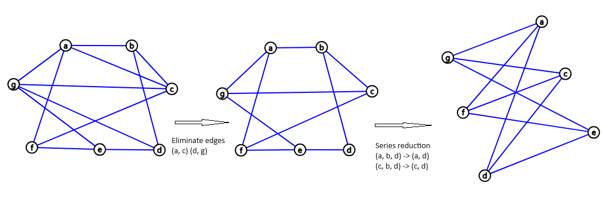

## Planar Graphs

### 1. Redraw the graph with no edges cross

### SOLUTION

---
### 2. Show the graph is not planar by finding a subgraph homeomorphic to either K5 or K3.3

### SOLUTION

Let us try to find $K_{3,3}$ in the graph. We first note that the vertices a, c, and g each have degree 4. In $K_{3,3}$ each vertex has degree 3, so let us eliminate the edges (a, c) and (d, g) so that all vertices have degree less or equale to 3. We note that edges (a, b) and (b, d) are in series, edges (c, b) and (b, d) are in series too. Deleting the vertex b will obtain a $K_{3,3}$ bipartite graph by series reduction.
Therefore, the graph is not a planar graph.

 

