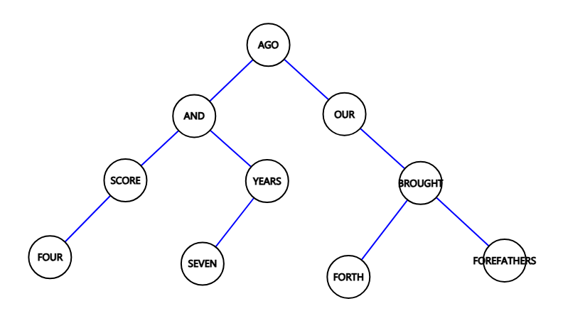

## Planar Graphs

### 1. Redraw the graph with no edges cross

### SOLUTION

---
### 2. Show the graph is not planar by finding a subgraph homeomorphic to either K5 or K3.3

### SOLUTION

Let us try to find $K_{3,3}$ in the graph. We first note that the vertices a, c, and g each have degree 4. In $K_{3,3}$ each vertex has degree 3, so let us eliminate the edges (a, c) and (d, g) so that all vertices have a degree less or equal to 3. We note that edges (a, b) and (b, d) are in series, and edges (c, b) and (b, d) are in series too. Deleting the vertex b will obtain a $K_{3,3}$ bipartite graph by series reduction.
Therefore, the graph is not a planar graph.

 

---

### 3. Show that in any simple, connected, planar graph, $e \le 3v-6$.

### SOLUTION
A graph with only 1 vertex, and 0 edge does not satisfy the formula.
And a graph with 2 vertices, and 2 edges does not satisfy the formula either.

## Introduction to Trees
### 4. Give the Huffman code below

(a) Decode the bit string $01111001001110$  
(b) Encode the word $LEADEN$

### SOLUTION
From the given Huffman code, we get the table
| Letter | Code  |
| :----: | :---- |
|   A    | 10    |
|   D    | 01111 |
|   E    | 00    |
|   L    | 01110 |
|   N    | 010   |
|   P    | 0110  |
|   S    | 11    |

(a) $01111001001110=DEAL$  
(b) $LEADEN=0111000100111100010$

---

### 5. Construct an optimal Huffman code for the set of letters in the table.
|    Letter     | Frequency |
| :-----------: | :-------: |
|   $\alpha$    |     5     |
|    $\beta$    |     6     |
|   $\gamma$    |     6     |
|   $\delta$    |    11     |
| $\varepsilon$ |    20     |
### SOLUTION
Repeatedly replacing the smallest 2 frequencies with the sum:

$$
\begin{aligned}
  5,6,6,11,20 &\rightarrow 5+6,6,11,20\\
  6,11,11,20 &\rightarrow 6+11,11,20\\
  11,17,20 &\rightarrow 11+17,20\\
  20,28
\end{aligned}
$$

Construct the tree working backward.

---

### 6. Show that a tree is a planar graph

### SOLUTION
A connected tree is a graph with n vertices and n-1 edges, there is no cycle in a tree, so the face of a tree is always 1.  
Thus the tree satisfies Euler's formula $f=e-v+2$ where $f=1,\ e=v-1$

## Terminology and Characterization of Tree
### 7.

(a) Find the children of d and of e.  
(b) Find the ancestors of c and of j.  
(c) Find the descendants of c and of e.  
(d) Find the terminal vertices.  
(e) Find the siblings of f and of h.

### SOLUTION
(a) The children of d are h and i, and the child of e is j.  
(b) The ancestors of c are a and b, and the ancestors of j are a, b, c, and e.  
(c) The descendants of c are e, f, g, and j, the descendant of e is j.  
(d) The terminal vertices are f, g, h, i, and j.  
(e) The siblings of f are e and g, and the sibling of h is i.

---

### 8. Draw a graph having the given properties or explain why no such graph exists.
(a) Tree; all vertices of degree 2  
(b) Acyclic; four edges, six vertices

### SOLUTION

(a) A tree with all vertices of degree 2 does not exist because all the terminal vertices of a tree have degree 1.  
(b)

## Spanning Trees
### 9. Use breadth-first search (Algorithm 9.3.6) with the vertex ordering hfdbgeca to find a spanning tree for graph G 

### SOLUTION
1. Add vertex h into the tree T, $T=\lbrace \lbrace h \rbrace, \varnothing \rbrace$
2. Add neighbor vertices of h into T, f is the only vertex incident to h, $T=lbrace \lbrace h,f \rbrace, \lbrace e_5 \rbrace \rbrace$
3. Add neighbor vertices of f into T, d and e are incident to f, $T=lbrace \lbrace h,f,d,e \rbrace, \lbrace e_5, e_4, e_6\rbrace \rbrace$
4. Add neighbor vertices of d into T, f, b, and c are incident to d, but f is alreay in T, so add b and c. $T=lbrace \lbrace h,f,d,e,b,c \rbrace, \lbrace e_5, e_4, e_6, e_3, e_7 \rbrace \rbrace$
5. Add neighbor vertices of e into T, f, c, and g are incident to e but f and c are already in T, so add g. $T=lbrace \lbrace h,f,d,e,b,c,g \rbrace, \lbrace e_5, e_4, e_6, e_3, e_7, e_{11} \rbrace \rbrace$
6. Add neighbor vertices of b into T, d, g, and a are incident to b but d and g are already in T, so add a. $T=lbrace \lbrace h,f,d,e,b,c,g,a \rbrace, \lbrace e_5, e_4, e_6, e_3, e_7, e_{11}, e_1 \rbrace \rbrace$
7. All the vertices are added in the tree, spanning tree completed.

---

### 10. Use depth-first search (Algorithm 9.3.7) with the vertex ordering hfdbgeca to find a spanning tree for graph G

### SOLUTION

## Minimal Spanning Tree
### 11. find the minimal spanning tree given by *Prim's Algorithm*

### SOLUTION
1. Start from vertex 1, add the vertex 1 to the tree T. $T= \lbrace\lbrace 1 \rbrace, \varnothing \rbrace$
2. Select the minimum weight edge from among the edges connects vertices in T and G shown in the table below:
   | Edge      | Weight | Tree                                                           |
   | --------- | :----: | -------------------------------------------------------------- |
   | **(1,2)** | **2**  | $T= \lbrace\lbrace 1,2 \rbrace, \lbrace (1,2) \rbrace \rbrace$ |
   | (1,4)     |   3    |                                                                |
   | (1,6)     |   3    |                                                                |
3. The edge (1,2) has the minimum weight, add it to T. Repeat step 2 and 3 until all the vertices are added to the tree. The edges added to the tree are:
   | Edge      | Weight | Tree                                                                   |
   | --------- | :----: | ---------------------------------------------------------------------- |
   | (1,4)     |   3    |                                                                        |
   | (1,6)     |   3    |                                                                        |
   | (2,3)     |   3    |                                                                        |
   | **(2,5)** | **1**  | $T= \lbrace\lbrace 1,2,5 \rbrace, \lbrace (1,2),(2,5) \rbrace \rbrace$ |

   | Edge      | Weight | Tree                                                                           |
   | --------- | :----: | ------------------------------------------------------------------------------ |
   | (1,4)     |   3    |                                                                                |
   | (1,6)     |   3    |                                                                                |
   | (2,3)     |   3    |                                                                                |
   | (5,4)     |   3    |                                                                                |
   | **(5,6)** |   2    | $T= \lbrace\lbrace 1,2,5,6 \rbrace, \lbrace (1,2),(2,5),(5,6) \rbrace \rbrace$ |

   | Edge      | Weight | Tree                                                                                   |
   | --------- | :----: | -------------------------------------------------------------------------------------- |
   | (1,4)     |   3    |                                                                                        |
   | (1,6)     |   3    |                                                                                        |
   | (2,3)     |   3    |                                                                                        |
   | (5,4)     |   3    |                                                                                        |
   | **(6,3)** |   2    | $T= \lbrace\lbrace 1,2,5,6,3 \rbrace, \lbrace (1,2),(2,5),(5,6),(6,3) \rbrace \rbrace$ |
   | (6,1)     |   3    |                                                                                        |

   | Edge      | Weight | Tree                                                                                           |
   | --------- | :----: | ---------------------------------------------------------------------------------------------- |
   | **(1,4)** | **3**  | $T= \lbrace\lbrace 1,2,5,6,3,4 \rbrace, \lbrace (1,2),(2,5),(5,6),(6,3),(1,4) \rbrace \rbrace$ |
   | (5,4)     |   3    |                                                                                                |
   | (3,4)     |   4    |                                                                                                |

---

### 12. If e is an edge in G whose weight is less than the weight of every other edge, e is in every minimal spanning tree of G. Is this statement true of false? Prove it or give a counterexample.

### SOLUTION
The statment is true.

**Prove**  
Let $T$ is a minimum spanning tree of the connected, weighted graph $G$, $e$ is the edge incident on $v_i$ and $v_j$, the weight $e$ $w(e) < w(e') \ \forall e' \in G \ , e' \ne e$.  
If $e$ is not in the MST, there must be another edge $(i, k)$ connect the vertex $v_i$ in the MST. Replace this edge with $e$ by connecting $v_i$ to $v_j$ would reduce the total weight of the tree, contradicting the assumption that the MST has the minimum possible weight.  
Hence, $e$ must be included in every MST of $G$.

## Binary Tree
### 13.  Place the words FOUR SCORE AND SEVEN YEARS AGO OUR FOREFATHERS BROUGHT FORTH, in the order in which they appear, in a binary search tree.

### SOLUTION

---

### 14. draw a graph having the given properties or explain why no such graph exists.
(a) Full binary tree; height = 4; nine terminal vertices  
(b) Full binary tree; height = 3; nine terminal vertices

### SOLUTION
(a)

(b) A full binary tree must have $t \le 2^h$, if $t=9, h=3$, it is not a full binary tree.

## Decision Trees
### 15. 
(a) Four coins are identical in appearance, but one coin is either heavier or lighter than the others, which all weigh the same. Draw a decision tree that gives an algorithm that identifies in at most two weighings the bad coin (but not necessarily determines whether it is heavier or lighter than the others) using only a pan balance.  
(b) Show that at least two weighings are required to solve the problem of (a)

### SOLUTION
(a)

(b) The four coins puzzle has 4 outcomes: C1, C2, C3, C4, the decision tree of height 2 has as most 4 terminal vertices, so it is able to solve the problem. If the decision tree height less than 2, the maximum termial vertices less than 2, so it is not able to solve the problem.